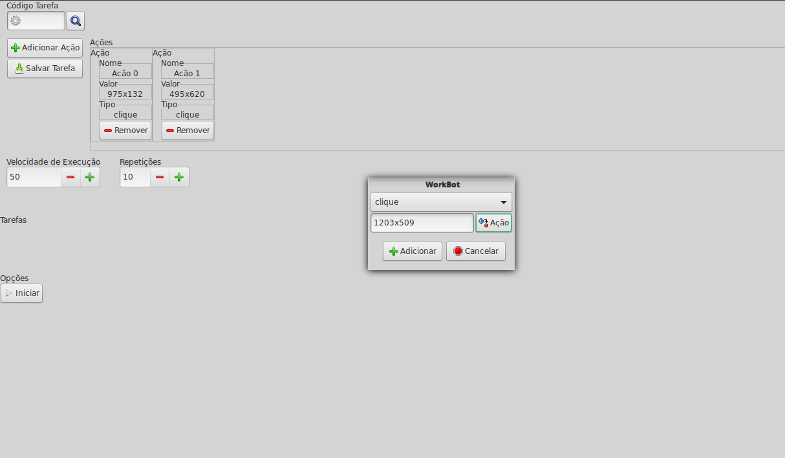

# Jober
> Bot Multitarefas.

Um Bot com capacidade de executar uma infinidade de ações predefinidas tais como

<ul>
<li>movimentação do mouse</li>
<li>manipulação do teclado</li>
<li>leitura de caracteres</li>
</ul>

## Instalação

<h3>Linux:</h3>

make

make install

Calisto – jovictor210@gmail.com

## Contribuindo

1. Fork (<https://github.com/Calistu/Jober/fork>)
2. Crie seu branch (`git checkout -b feature/fooBar`)
3. Comite as alterações (`git commit -am 'Add some fooBar'`)
4. Suba como branch (`git push origin feature/fooBar`)
5. Crie um pull request
